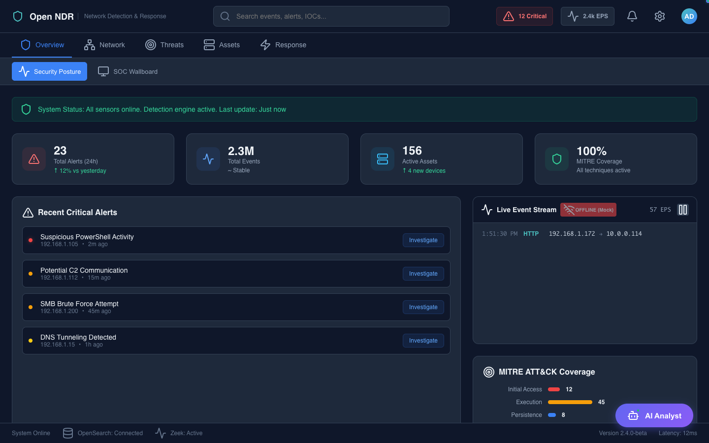

# Open NDR Dashboard

[](https://nutthakorn7.github.io/ndr/)
[](https://github.com/nutthakorn7/ndr)
[](LICENSE)

🔴 **[View Live Demo →](https://nutthakorn7.github.io/ndr/)**

Enterprise-grade Network Detection & Response (NDR) platform with real-time threat visualization and advanced security analytics.


## ✨ Features

### 🎯 Security Operations Center (SOC)
- **Real-time Threat Map** - Interactive world map showing live threat origins
- **Operational Metrics** - MTTR, SLA compliance, analyst workload
- **Priority Incident Management** - Automated severity classification

### 🔍 Detection & Analysis
- **Network Analytics** - Deep packet inspection and traffic analysis
- **Event Search** - Advanced querying with filters and correlation
- **Alert Investigation** - MITRE ATT&CK framework integration
- **Real-time Feed** - Live event streaming with pause/resume

### 🛡️ Advanced Capabilities
- **SSL/TLS Analysis** - Certificate inspection and JA3 fingerprinting
- **File Analysis** - YARA scanning and sandbox integration
- **DNS Intelligence** - Suspicious domain detection
- **Threat Intelligence** - IOC feeds and reputation scoring

### 🤖 Automation
- **SOAR Integration** - Automated response playbooks
- **SIEM Connectors** - Integration with major SIEM platforms
- **Asset Discovery** - Automatic network inventory

## 🚀 Quick Start

### View Demo (No Installation)
Visit the [live demo](https://nutthakorn7.github.io/ndr/) to explore all features with simulated data.

### Run Locally

```bash
# Clone repository
git clone https://github.com/nutthakorn7/ndr.git
cd ndr/ui

# Install dependencies
npm install

# Start development server
npm run dev

# Open browser to http://localhost:5173
```

## 🏗️ Architecture

```
┌─────────────────────────────────────────────┐
│           React Frontend (Vite)             │
│  ┌──────────┐ ┌──────────┐ ┌─────────────┐ │
│  │Dashboard │ │Analytics │ │Threat Intel │ │
│  └──────────┘ └──────────┘ └─────────────┘ │
└────────────────┬────────────────────────────┘
                 │ REST API
┌────────────────┴────────────────────────────┐
│         Backend Services (Coming)           │
│  ┌──────────┐ ┌──────────┐ ┌─────────────┐ │
│  │Dashboard │ │  Zeek    │ │ Suricata    │ │
│  │ API (Rust) │ │ Analysis │ │  IDS/IPS    │ │
│  └──────────┘ └──────────┘ └─────────────┘ │
└─────────────────────────────────────────────┘
```

## 📊 Screenshots

### SOC Wallboard

Real-time operational metrics and global threat map

### Network Analytics

Traffic visualization and protocol analysis

### Alert Investigation

Detailed alert context with MITRE ATT&CK mapping

## 🛠️ Tech Stack

**Frontend:**
- React 18 with Hooks
- Vite (build tool)
- Recharts (data visualization)
- Lucide React (icons)
- CSS3 (dark theme)

**Backend:**
- Rust (Axum, Tokio) - High-performance Microservices
- OpenSearch - Log Storage
- PostgreSQL - Metadata
- Redis - Caching & Queues
- Suricata - IDS/IPS Engine
- Tcpdump - Packet Capture
- Docker & Docker Compose

## 📈 Current Status

✅ **Frontend:** Production-ready with real-time data
✅ **Backend:** Full microservices stack integrated
✅ **Advanced:** AI Analysis, Suricata IDS, & PCAP enabled

## 🗺️ Roadmap

### Phase 1: Frontend (✅ Complete)
- [x] All UI components
- [x] Interactive dashboards
- [x] Real-time data simulation
- [x] Responsive design

### Phase 2: Backend Integration (✅ Complete)
- [x] API endpoints (Dashboard, Asset, Auth)
- [x] Real data pipeline (OpenSearch, Postgres)
- [x] Authentication (JWT + API Key)
- [x] WebSocket for real-time events

### Phase 3: Advanced Features (✅ Complete)
- [x] Suricata IDS Integration
- [x] Full Packet Capture (PCAP)
- [x] Query Builder & Correlation Graph
- [x] AI-Powered Analysis (Triage & Chat)

### Phase 4: Enterprise & Cloud (🚀 Planned)
- [ ] Cloud Deployment (AWS/Azure/GCP)
- [ ] Multi-Tenancy Support
- [ ] Compliance Reporting (PCI-DSS, HIPAA)
- [ ] Advanced AI Agents (Autonomous Response)
- [ ] SSO / SAML Integration

## 📚 Documentation

- [Deployment Guide](DEPLOY_DEMO.md) - How to deploy the demo
- [API Integration](ui/API_INTEGRATION.md) - Backend integration guide
- [Feature Gap Analysis](UI_FEATURE_GAP_ANALYSIS.md) - Roadmap details
- [Production Readiness](docs/production_readiness.md) - Deployment checklist

## 🤝 Contributing

Contributions are welcome! Please feel free to submit a Pull Request.

## 📄 License

MIT License - see [LICENSE](LICENSE) file for details

## 🙏 Acknowledgments

- Inspired by enterprise SIEM/NDR platforms
- Built with modern web technologies
- Designed for SOC analysts

---

**Made with ❤️ for the cybersecurity community**

⭐ Star this repo if you find it useful!
