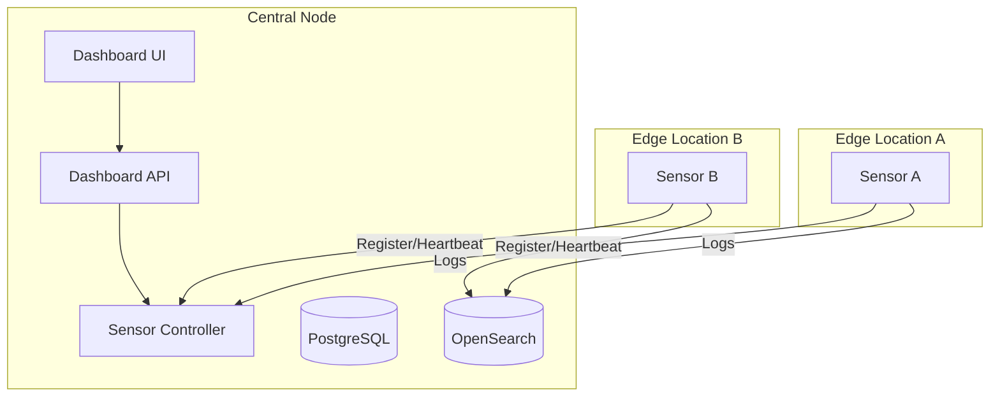

# Multi-Sensor Deployment Guide

This guide explains how to deploy the NDR platform in a distributed architecture with a Central Management Node and multiple Edge Sensor Nodes.

## 🏗️ Architecture

- **Central Node**: Hosts the Dashboard, API, Database, and Sensor Controller.
- **Edge Sensors**: Lightweight collectors deployed at various network locations (e.g., Branch Office, Data Center) that send data back to the Central Node.



---

## 1. Central Node Setup

Deploy the core infrastructure on your primary server.

1.  **Configure Environment**:
    Ensure `docker-compose.yml` has `sensor-controller` enabled (it is by default).

2.  **Start Services**:
    ```bash
    docker-compose up -d
    ```

3.  **Verify Controller**:
    Check if the Sensor Controller is running:
    ```bash
    curl http://localhost:8084/health
    # Output: {"status":"healthy",...}
    ```

---

## 2. Edge Sensor Setup

You can deploy sensors using **Docker** (manual) or **Ansible** (automated).

### Option A: Docker (Quick Start)

Run this on the remote Linux machine you want to use as a sensor.

1.  **Prerequisites**: Docker installed.
2.  **Run Sensor Agent**:
    Replace `CENTRAL_NODE_IP` with the IP address of your Central Node.

    ```bash
    docker run -d \
      --name ndr-sensor \
      --restart always \
      -e CONTROLLER_URL=http://CENTRAL_NODE_IP:8084 \
      -e SENSOR_NAME="Branch-Office-1" \
      -e SENSOR_LOCATION="Bangkok" \
      -e SENSOR_SECRET="ndr-demo-secret" \
      nutthakorn7/sensor-agent:latest
    ```

### Option B: Ansible (Production)

For managing a fleet of sensors, use the provided Ansible playbook.

1.  **Edit Inventory**:
    Update `infra/ansible/inventory/hosts.ini`:
    ```ini
    [sensors]
    192.168.10.50 sensor_name="DC-Sensor-1" controller_url=http://10.0.0.1:8084
    ```

2.  **Run Playbook**:
    ```bash
    cd infra/ansible
    ansible-playbook -i inventory/hosts.ini deploy-sensors.yml
    ```

    *See [On-Prem Sensor Guide](deployment/on-prem-sensors.md) for full details.*

---

## 3. Verification

1.  **Check Dashboard**:
    Go to **Sensor Management** in the UI. You should see the new sensor listed with status **Online**.

2.  **Check Logs**:
    Verify that the sensor is sending heartbeats and logs to the Central Node.
